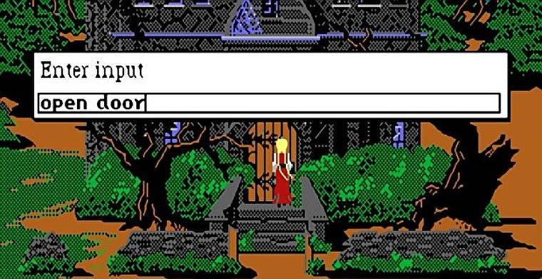
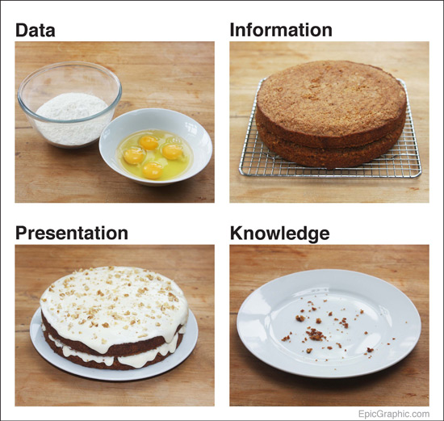

# Personal Information

## Lee van den Blink
- RMIT Student # 3792973
- RMIT Email: s3792973@student.rmit.edu.au
- Personal email lee.vandenblink@gmail.com
- Language spoken: English
- Religion: Atheist

### Education 

<b>Short Courses</b>
- 2014 - Essentials for the Internal Auditor
- 2012 - Advanced Microsoft Excel training
- 2012 - Intermediate Microsoft Access training
- 2011 - RPL Workshop
- 2010 - Adobe Dreamweaver training 
- 2010 - Adobe Flash training 
- 2008 - Advanced Word Training (Long Documents) 

<b>Certificate III in Business Administration</b>, - Link Employment and Training, 2007

<b>Kilvington Girls Grammar</b> - Completed VCE certificate, 1997 - 1998

I’m 38 years old, and live with my husband and two young girls.  Melbourne born and raised, my first job after high school was general administration at an importing company as a shipping clerk.  I then moved into the vocational education sector, starting at front desk but as I like to stay busy I often increase the scope of my role quickly when starting at a new workplace.  I currently work part time as an administration and compliance officer at a Registered Training Organisation (RTO) with a small and focused team, and we specialise in delivering VET qualifications in vocational music industry qualifications to schools across australia through auspice arrangements.

I have a lot of different interests, but my biggest passion is video games and I can easily become absolutely absorbed in the worlds and characters.  I seek out the soundtracks and listen to them when  running or driving, or even doing the dishes.  It's fun to make day to day tasks feel more inspired  with an epic soundtrack! I believe this involvement with story telling keeps my imagination active, and I’m incredibly inspired by the design and innovation that is continuously driving this ever evolving market, which I feel runs in parallel with the IT industry and its technology capabilities.  When you look at MMORPGS, MOBAs or any other number of online gaming and streaming services, there is a tonne of  infrastructure and technology involved, often utilising the latest technology advancements at its disposal - and yet people will instantly complain when sound get clippy or frame rates drop!

I also really love listening to podcasts in my spare time as they are a great way to learn new things and make the most out of all that driving time.  My favourites topics for podcasts are history, atheism and recaps podcasts of my favourite tv shows, like Game of Thrones and Better Call Saul.     

## Interest in IT

### When did your interest in IT start?

I’ve been interested and familiar with computers since a very young age.  I used to play King's quest iv: The Perils of Rosella on my parent's old 486 computer when I was 8, and improved quickly at typing due to all those ‘look at X’ and ‘use X’ commands. My interest has only grown since then. 

 

<i>Image: Rule # 1 of 80's adventure games - Make sure you save before you do ANYTHING.  </i>

<a href="https://www.rockpapershotgun.com/2018/04/25/kings-quest-iv-a-love-letter-from-my-3-year-old-heart/">https://www.rockpapershotgun.com/2018/04/25/kings-quest-iv-a-love-letter-from-my-3-year-old-heart/</a>

Being around computers from a young age made them very normal for me, and I think my natural tendency to try and organise and understand things in my head made understanding computers and how they worked a little easier.  

### Was there a particular event or person that sparked your interest?

I’ve always been curious and investigative about computers and applications.  Sometimes to my detriment.  For example in year 11 I got the schools recommended laptop.  It came pre-installed with numerous software, most of which I didn’t recognise or think I needed. I jumped into the file explorer and started deleting anything I didn’t recognise, thinking I was just uninstalling programs.  The next time I tried to boot up I only got a very cryptic error message.  I’d obviously gone too heavy handed in my haste to ‘clean’ my new laptop and deleted something critical to the operating system.  So my first lesson in IT was understand what you’re dealing with before you act.  But I also realised there was a natural curiosity there trying to organise and understand the internal workings of a PC.  There are also other factors that have helped me decide on pursuing my interest further.  Being the Systems Administrator at two previous jobs gave me a lot of contact with IT professionals, and I always took this as an opportunity to learn as much as I could, and a lot of the people I got to know quite well and really respected.  I realised I wanted to be more like them and really understand IT on a much deeper level.     

### Outline your IT experience 
I’ve worked with 3 different RTOs over the last decade or so and have learnt a great deal about the industry, but moreover I learnt that I was actually good with this computer thing.  I could solve other peoples technical issues; I could grasp the concepts of what the IT consultants would recommend, although on a somewhat rudimentary level - basically I feel like I can understand the gap between people and systems.  I love extracting and reporting on data and providing insight into the business based on what the database reports.  

 

<i>Image: I think Mark Johnstone’s data cake graphic sums up data analysis really well.</i>

<a href="http://markjohnstone.co/data-cake/">http://markjohnstone.co/data-cake/</a>

I’ve also been heavily involved in system migration and have ran introductory training session for system migrations.  The first was moving from  Microsoft exchange to the Gmail Suitel, and again when we switched our Student Management System (SMS) software providers.  Also being involved with student management systems and RTO reporting rules,  there is a significant  amount of data error troubleshooting, and I have always enjoyed solving those puzzles.

### What is your interest in IT?

I feel like my ability to understand IT and computers is something I should pursue further, as its already something I enjoy, and could potentially be very successful with.  My two main areas of interest in IT are data organisation/analysis, and learning more about software development and programming, with the hope of this one day leading me to be involved in the development of video games or if not games, then to be involved in software or system development.    

### Why did you choose to come to RMIT?
Being someone with an already full plate due to a young family and work commitments,  I knew online study was my only realistic option.  My husband had also recently completed his Graduate Certificate in Business with RMIT last year, and he added that studying at a Melbourne based university was potentially helpful for group assignments, plus the general lay out the Learning Management System worked well, which gave me another vote of confidence.  RMIT is also a very highly rated university so it would mean the degree has a prestigious name attached to it.

### What do you expect to learn during your studies?
The reason I have chosen Bachelor of IT is I don’t want to limit myself to video game design concepts only.  All business’ need IT of some description, whether it’s through a consultation service or housing their own staff or department, and I think I understand the gap between end users and systems.  Specifically I’d like to develop my knowledge of  API integration and its potential, learn more about programming languages and software development (including but not limited to game design), and how IT projects are planned, costed and managed.  

## My Ideal Job

When initially looking for my ideal job I originally found a data analyst role that I thought suited me (<a href="https://leevdb.github.io/Lee-van-den-Blink/Ideal_Job2">You can read more about that thought experiment here</a>) , however after thinking about my test results and the sort of work I really enjoy, I continued searching and found the following role, which I believe I would actually enjoy more.  The main reason for the change is I realised that the data analyst role didn’t have as much scope for creativity and presenting original ideas as the Game Programmer role suggests, and I also think I would really enjoy the problem solving element that being a programmer would provide.

### Job Title - Game Programmer

<b>Company: ZeniMax Media Inc. - Bethesda Game Studios</b>

<a href="https://jobs.zenimax.com/requisitions/view/76"> https://jobs.zenimax.com/requisitions/view/76 </a>

<i>Image 4: Game Programmer job listing</i>

<b>Position Description:</b>

Looking past the location requirement, I found a job listing with ZeniMax Media for a Game Programmer.  The role is working in a team to write and develop specific code for a larger game project.  There would be a lot of solo programming work while also working closely with many other areas of game development.  

<b>Required Skills, qualifications and experience:</b>
- Bachelor of Science in Computer Science or Mathematics
- Proficiency with C++ and object oriented programming
- Development experience (in both game industry and on consoles)
- Contribute ideas to game production and development
- Strong communication and organisational skills
- Ability to work under pressure and prioritise multiple tasks
- Passion for making GREAT games
- Experience playing previous Bethesda Game Studios games

<b>My current Skills, qualifications and experience:</b>
- Strong communication and organisational skills
- Ability to work under pressure and prioritise multiple tasks
- Passion for making GREAT games
- Experience playing previous Bethesda Game Studios games (Elder Scrolls series, Fallout series, Prey, Dishonoured, Doom)
- Project management experience (note - not related to games industry)

<b>Plan to achieve my Ideal job:</b>
- Complete Bachelor of Information Technology Degree
- Become experience in C++ and object oriented programming - This is something I could begin to develop as part of the degree but there is also a vast number of resources available online for learning more about C++, such as youTube or udemy.com to name a few.  
- Development experience, Contributing ideas experience - This particular aspect of the role I’m not sure on how i could go about getting this.  It could develop naturally through development of programming knowledge, and maybe via an entry level programming for software development job as a starting point.   

<a href="https://leevdb.github.io/Lee-van-den-Blink/profile">My Personal Profile</a>

<a href="https://leevdb.github.io/Lee-van-den-Blink/Project">My Project Idea</a>

<a href="https://leevdb.github.io/Lee-van-den-Blink/">Back to the home page</a>

### References

 Rock Paper Shotgun, 2019, Viewed 11/03/2019 https://www.rockpapershotgun.com/2018/04/25/kings-quest-iv-a-love-letter-from-my-3-year-old-heart/ 

 Mark Johnstone, Creative Content Marketing, 2016, Viewed 11/03/2019 http://markjohnstone.co/data-cake/ 

 Zenimax.com - Reqisitions, Viewed 09/03/2019 https://jobs.zenimax.com/requisitions/view/76 

 Zenimax.com - Reqisitions, Viewed 09/03/2019 https://jobs.zenimax.com/requisitions/view/2080 

 Tableau.com, Viewed 10/03/2019 https://www.tableau.com/learn/training 

 Tableau.com, Viewed 10/03/2019 https://www.tableau.com/learn/training/elearning 

 16 Personalities, NERIS Analytics Limited 2019, Viewed 07/03/2019 https://www.16personalities.com/profiles/d55ee484a7f41

 Education Planner, Viewed 07/03/2019 http://www.educationplanner.org/students/self-assessments/learning-styles-quiz.shtml

 Test my Creativity, Viewed 07/03/2019 http://www.testmycreativity.com/

 Game Save Manager, Viewed 11/03/2019 https://www.gamesave-manager.com/

