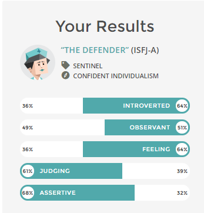
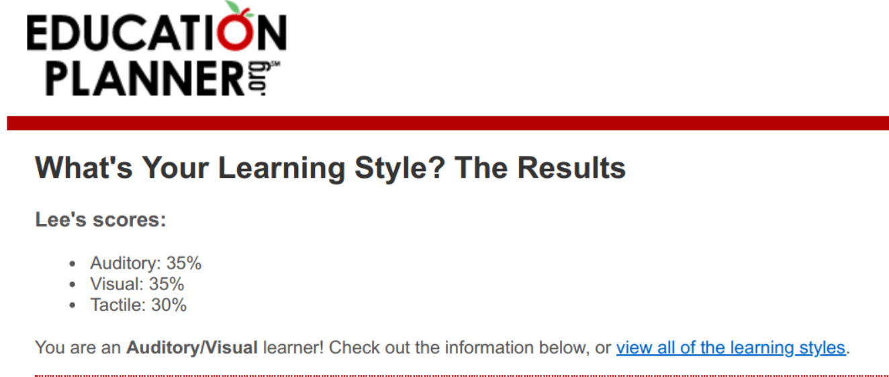
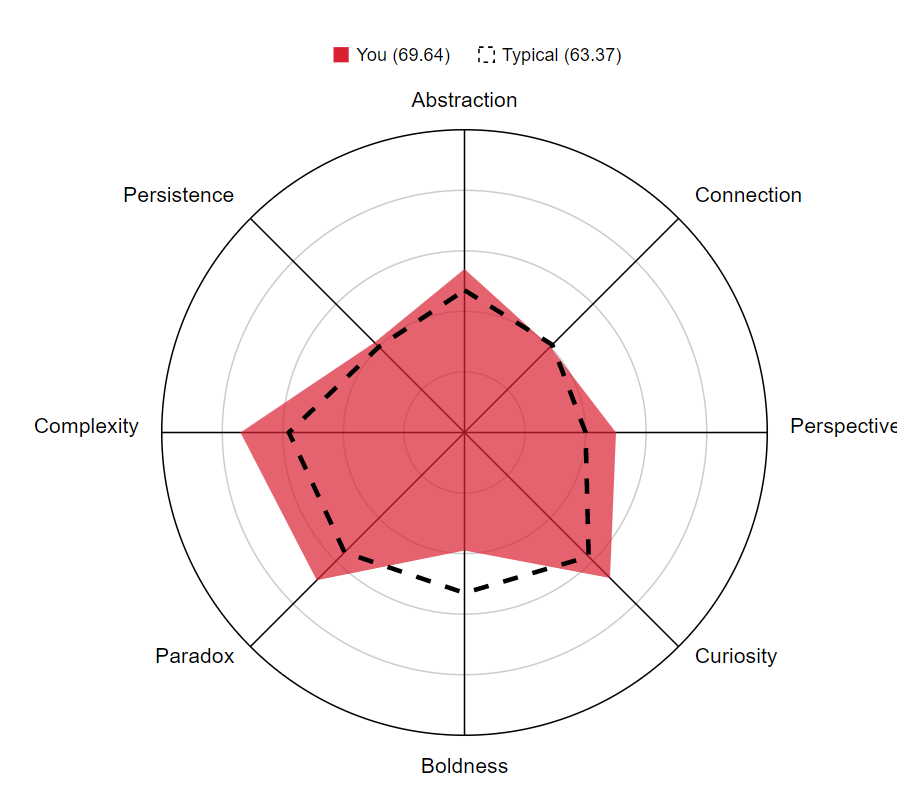
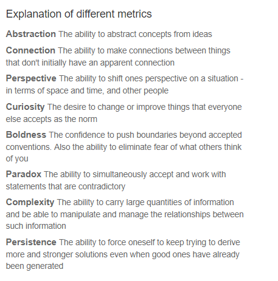

# Personal Profile

### Myers-Briggs Test Results

<b>Result: ISFJ -A-T personality type - “The Defender” </b>

<i>Image: Myers-Briggs Results - The Defender ISFJ-A</i>
https://www.16personalities.com/profiles/d55ee484a7f41

### Online learning style results
<b> Result: Equal parts Auditory and Visual </b>

<i>Image: Learning Style Results - Auditory/Visual learner</i>

http://www.educationplanner.org/students/self-assessments/learning-styles-quiz.shtml

### Creativity test 
<b>Result: Creativity score 69.64</b>
Strongest areas: Curiosity, Complexity, Paradox
Weakest areas: Boldness, Connection, Persistence

<i>Image 9: Creativity test score</i>

http://www.testmycreativity.com/

## What do the results of these tests mean for you?
The most revealing test to me was the Myers-Briggs test.  I wasn’t sure where i was on the emotional/logical scale as sometimes I feel like I have both.  Having a result like above basically confirm this was very affirming.  The result type I got was I think a very positive personality type and my specific results had a fairly even balance between the opposing traits.  Many of the traits mentioned felt true to me when reading this result type, such as being someone who likes to do things to a high standard, and take on the ‘boring’ tasks if thats whats required.  I also do tend to have pretty good relationships in my workplaces.

I already had a good idea that I was an audio/visual learner, as I usually like to listen to music while I work on something and I find it helps me concentrate, and I also love to represent things in charts and graphs as I feel sometimes a graphic is worth more then the sum of its parts.

The creativity test was a positive result for me as I’ve often doubted my own creativity, but I’m realising that I do have some aptitude for this.  Problem solving requires one to have some lateral thinking capability to be truly effective, and I imagine this is a big part of programming and IT in general.  There is no one size fits all in software development or business in general and in most cases hings will always need to be adapted.

### How do you think these results may influence myour behaviour in a team?
I already know from both my work experience and in my personal life that I’m an adept team player, and this matches up with the Myers-Briggs result as well.  I don’t mind doing the leg work for a project if thats whats required, and if there is a gap in the team I will try to work out a way to adapt to what's needed.  I already have noticed myself taking on a bit of a captain role in our current group as I like to make sure communication between all members is harmonious.  Even though I see myself or seek out management roles I may end up putting myself in a project management type role for the upcoming group project, especially if no one else is willing to do it. 

### How should you take this into account when forming a team?
By understanding the role I prefer to play is more of a supporting role, I will typically defer to others to make sure the team is happy with the project.  I should try to ensure that I seek out a team that has good communication and motivation, and aim to work with someone with a strong voice that can lead the ship, as I see myself as an effective 2IC.  I also need to realise that sometimes I will need to speak up and pick a side, or quickly aim to resolve issues if they arise, as I could hopefully do this with diplomacy and aim to avoid potential conflict.  

<a href="https://leevdb.github.io/Lee-van-den-Blink/profile">My Personal Profile</a>

<a href="https://leevdb.github.io/Lee-van-den-Blink/Project">My Project Idea</a>

<a href="https://leevdb.github.io/Lee-van-den-Blink/">Back to the home page</a>

